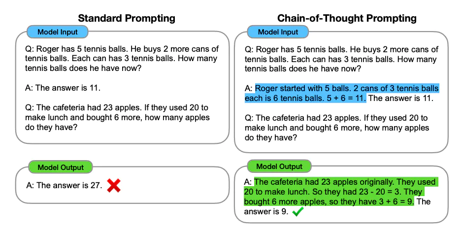
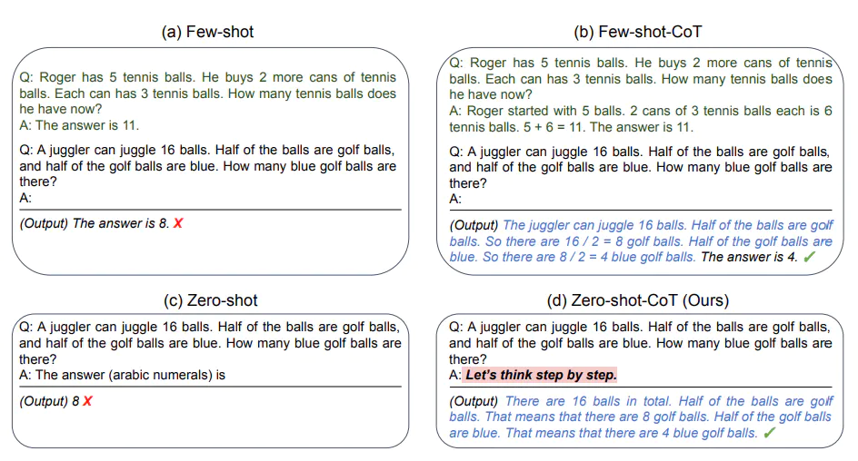
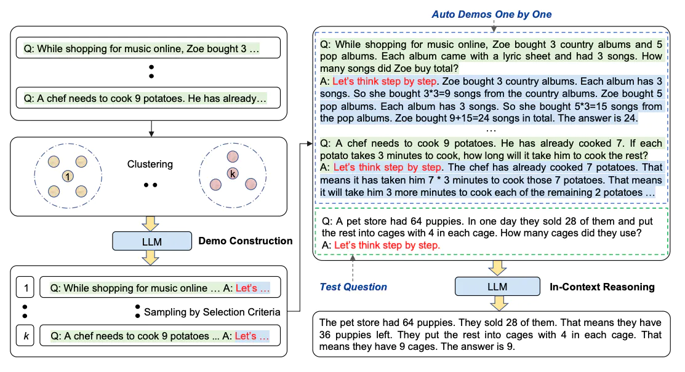
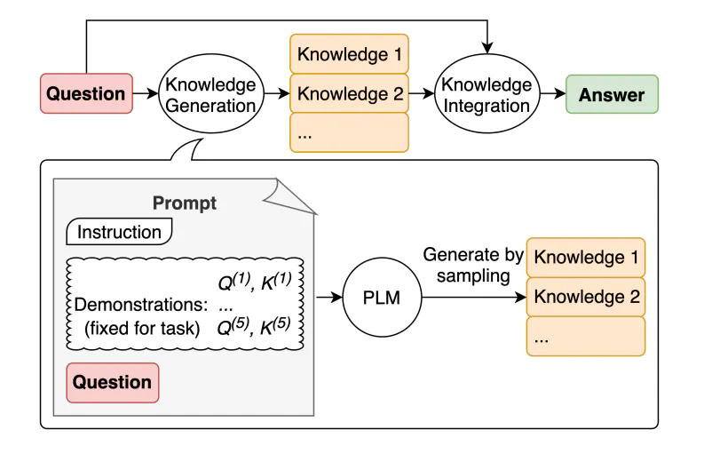
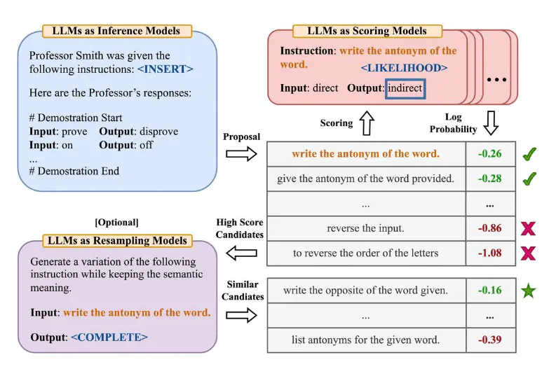

# Prompt Engineering


<br />

## Introduction:
### __What is Prompt Engineering?__
### Prompt engineering is the name given to the process of coming up with the best sentence or phrase to ask large language models, such as ChatGPT, in order to get back the best possible response.

###  - __What is a prompt?__
### A prompt is the starting question that is asked to a large language model. The prompt sets the tone, background knowledge, and usually includes the core question for a specific problem. For example, if you wanted to ask a language model about the weather, you might ask the question, "What is the weather like today?" This question would be the prompt.

<br />

----------------------------------------
<br/>

## **Basics of Prompting**:
### You can achieve a lot with simple prompts, but the quality of results depends on how much information you provide it and how well-crafted it is. A prompt can contain information like the instruction or question you are passing to the model and include other details such as context, inputs, or examples. You can use these elements to instruct the model better and as a result get better results.

### __EXAMPLE:__

### prompt:

```
The sky is
```

### Output: 

```
blue
The sky is blue on a clear day. On a cloudy day, the sky may be gray or white.
```

### As you can see, the language model outputs a continuation of strings that make sense given the context "The sky is". The output might be unexpected or far from the task you want to accomplish.

### Let's try to improve it a bit:

### prompt:

```
Complete the sentence: 
The sky is
```

### Output: 

```
so  beautiful today.
```

## __Prompt Formattigng:__

```
<Question>?
```

### OR

```
<Instruction>
```

### You can format this into a question answering (QA) format, which is standard in a lot of QA datasets, as follows:

```
Q: <Question>?
A: 
```

### - You can also perform a simple classification task and give exemplars that demonstrate the task as follows:

### prompt:

```
This is awesome! // Positive
This is bad! // Negative
Wow that movie was rad! // Positive
What a horrible show! //
```

### Output: 

```
Negative
```

<br />

-------------------------------------------------------------------------------------

<br />

## __Elements of a Prompt__:

- ### Instructions:
  - ### Instructions are the first part of a prompt. They are used to instruct the model on what to do. 


- ### Context:
    - ### Context is used to provide the model with background information.


- ### Inputs:
    - ### Inputs are used to provide the model with information that it can use to generate a response.


- ### Outputs:
    - ### The type or format of the output.
 

<br />

----------------------------------------

<br />


## __Examples of Prompts__:

1. ### __Text Summarization__:


### Prompt:

```
Explain antibiotics
```

### Output:

```
Antibotics are ........
```

### Prompt:

```
Antibiotics are a type of medication used to treat bacterial infections. They work by either killing the bacteria or preventing them from reproducing, allowing the body’s immune system to fight off the infection. Antibiotics are usually taken orally in the form of pills, capsules, or liquid solutions, or sometimes administered intravenously. They are not effective against viral infections, and using them inappropriately can lead to antibiotic resistance.
Explain the above in one sentence:
```

### Output:

```
Antibiotics are medications used to treat bacterial infections by either killing the bacteria or stopping them from reproducing, but they are not effective against viruses and overuse can lead to antibiotic resistance.
```


2. ### __Information Extraction:__

### Prompt:

```
Author-contribution statements and acknowledgements in research papers should state clearly and specifically whether, and to what extent, the authors used AI technologies such as ChatGPT in the preparation of their manuscript and analysis. They should also indicate which LLMs were used. This will alert editors and reviewers to scrutinize manuscripts more carefully for potential biases, inaccuracies and improper source crediting. Likewise, scientific journals should be transparent about their use of LLMs, for example when selecting submitted manuscripts.
Mention the large language model based product mentioned in the paragraph above:
```

### Output:

```
The large language model based product mentioned in the paragraph above is ChatGPT.
```

3. ### __Question Answering:__


### Prompt:

```
Answer the question based on the context below. Keep the answer short and concise. Respond "Unsure about answer" if not sure about the answer.
Context: Teplizumab traces its roots to a New Jersey drug company called Ortho Pharmaceutical. There, scientists generated an early version of the antibody, dubbed OKT3. Originally sourced from mice, the molecule was able to bind to the surface of T cells and limit their cell-killing potential. In 1986, it was approved to help prevent organ rejection after kidney transplants, making it the first therapeutic antibody allowed for human use.
Question: What was OKT3 originally sourced from?
Answer:
```

### Output:

```
OKT3 was originally sourced from mice.
```

4. ### __Text Classification:__

### Prompt:

```
Classify the text into neutral, negative or positive. 
Text: I think the food was okay. 
Sentiment:
```

### Output:

```
Neutral
```

5. ### __Code Generation:__


### Prompt:

```
/*
Ask the user for their name and say "Hello"
*/
```

### Output:

```
let name = prompt("What is your name?");
console.log(`Hello, ${name}!`);
```

6. ### __Reasonging:__
Perhaps one of the most difficult tasks for an LLM today is one that requires some form of reasoning. Reasoning is one of most interesting areas due to the types of complex applications that can emerge from LLMs.


### Prompt:

```
What is 9,000 * 9,000?
```

### Output:

```
81,000,000
```

### Prompt:

```
The odd numbers in this group add up to an even number: 15, 32, 5, 13, 82, 7, 1. 
A: 
```

### Output:

```
No, the odd numbers in this group add up to an odd number: 119.
```

That is not correct. Let's try to improve this by improving the prompt.

### Prompt:

```
The odd numbers in this group add up to an even number: 15, 32, 5, 13, 82, 7, 1. 
Solve by breaking the problem into steps. First, identify the odd numbers, add them, and indicate whether the result is odd or even. 
A: 
```

### Output:

```
Odd numbers: 15, 5, 13, 7, 1
Sum: 41 
41 is an odd number.
```

<br />


-------------------------------------------------------------------------------------

<br />

## __Techniques:__

- ### Zero-shot Prompting: 
  is a technique where LLMs, trained on massive amounts of data and adjusted to obey instructions, can perform tasks on the fly without any prior examples. However, when zero-shot prompting fails, it is advisable to include demonstrations or instances in the prompt, leading us to the concept of few-shot prompting.


### Prompt:

```
Classify the text into neutral, negative or positive. 
Text: I think the vacation is okay.
Sentiment:
```

### Output:

```
Neutral
```

- ### Few-shot Prompting: 
  Few-shot prompting is a strategy that enables in-context learning. It involves presenting examples in the prompt to guide the model toward higher performance. These examples serve as conditioning for later cases where we want the model to respond. For more complex tasks, the number of demonstrations can be increased (e.g., 3-shot, 5-shot, 10-shot, etc.).


### Prompt:

```
A "whatpu" is a small, furry animal native to Tanzania. An example of a sentence that uses
the word whatpu is:
We were traveling in Africa and we saw these very cute whatpus.
To do a "farduddle" means to jump up and down really fast. An example of a sentence that uses
the word farduddle is:
```

### Output:

```
When we won the game, we all started to farduddle in celebration.
```


- ### Chain-of-Thought Prompting:
  It can be used in conjunction with few-shot prompting to improve performance on more difficult activities that require thought before answering. This technique is particularly useful for tasks that require step-by-step reasoning.



### Prompt:

```
The odd numbers in this group add up to an even number: 4, 8, 9, 15, 12, 2, 1.
A: Adding all the odd numbers (9, 15, 1) gives 25. The answer is False.
The odd numbers in this group add up to an even number: 17,  10, 19, 4, 8, 12, 24.
A: Adding all the odd numbers (17, 19) gives 36. The answer is True.
The odd numbers in this group add up to an even number: 16,  11, 14, 4, 8, 13, 24.
A: Adding all the odd numbers (11, 13) gives 24. The answer is True.
The odd numbers in this group add up to an even number: 17,  9, 10, 12, 13, 4, 2.
A: Adding all the odd numbers (17, 9, 13) gives 39. The answer is False.
The odd numbers in this group add up to an even number: 15, 32, 5, 13, 82, 7, 1. 
A:
```

### Output:

```
Adding all the odd numbers (15, 5, 13, 7, 1) gives 41. The answer is False.
```


- ### Zero-shot COT Prompting: 
  is a recent concept that involves adding “Let’s think step by step” to the original prompt. This technique is particularly useful where you don’t have too many examples to use in prompt engineering.



  
### Prompt:

```
I went to the market and bought 10 apples. I gave 2 apples to the neighbor and 2 to the repairman. I then went and bought 5 more apples and ate 1. How many apples did I remain with?
Let's think step by step.
```

### Output:

```
First, you started with 10 apples.
You gave away 2 apples to the neighbor and 2 to the repairman, so you had 6 apples left.
Then you bought 5 more apples, so now you had 11 apples.
Finally, you ate 1 apple, so you would remain with 10 apples.
```

- ### Automatic Chain-of-Thought (Auto-CoT):
  When applying chain-of-thought prompting with demonstrations, the process involves hand-crafting effective and diverse examples. This manual effort could lead to suboptimal solutions. Zhang et al. (2022) propose an approach to eliminate manual efforts by leveraging LLMs with "Let's think step by step" prompt to generate reasoning chains for demonstrations one by one. This automatic process can still end up with mistakes in generated chains. To mitigate the effects of the mistakes, the diversity of demonstrations matter. This works proposes Auto-CoT, which samples questions with diversity and generates reasoning chains to construct the demonstrations.

- ### Auto-CoT consists of two main stages:
   - ### **question clustering:** partition questions of a given dataset into a few clusters.
   - ### **demonstration sampling:** select a representative question from each cluster and generate its reasoning chain using Zero-Shot-CoT with simple heuristics




- ### __Self-Consistency:__
  it aims to replace the naive greedy decoding used in chain-of-thought prompting. The goal is to sample several different reasoning routes using few-shot CoT and then use the generations to choose the most consistent solution. This improves the performance of CoT prompting on arithmetic and commonsense reasoning tests.


### Prompt:

```
When I was 6 my sister was half my age. Now
I’m 70 how old is my sister?
```

### Output:

```
35
```	

The output is wrong! How may we improve this with self-consistency? Let's try it out. We will use the few-cot. 


### Prompt:

```
Q: There are 15 trees in the grove. Grove workers will plant trees in the grove today. After they are done,
there will be 21 trees. How many trees did the grove workers plant today?
A: We start with 15 trees. Later we have 21 trees. The difference must be the number of trees they planted.
So, they must have planted 21 - 15 = 6 trees. The answer is 6.
Q: If there are 3 cars in the parking lot and 2 more cars arrive, how many cars are in the parking lot?
A: There are 3 cars in the parking lot already. 2 more arrive. Now there are 3 + 2 = 5 cars. The answer is 5.
Q: Leah had 32 chocolates and her sister had 42. If they ate 35, how many pieces do they have left in total?
A: Leah had 32 chocolates and Leah’s sister had 42. That means there were originally 32 + 42 = 74
chocolates. 35 have been eaten. So in total they still have 74 - 35 = 39 chocolates. The answer is 39.
Q: Jason had 20 lollipops. He gave Denny some lollipops. Now Jason has 12 lollipops. How many lollipops
did Jason give to Denny?
A: Jason had 20 lollipops. Since he only has 12 now, he must have given the rest to Denny. The number of
lollipops he has given to Denny must have been 20 - 12 = 8 lollipops. The answer is 8.
Q: Shawn has five toys. For Christmas, he got two toys each from his mom and dad. How many toys does
he have now?
A: He has 5 toys. He got 2 from mom, so after that he has 5 + 2 = 7 toys. Then he got 2 more from dad, so
in total he has 7 + 2 = 9 toys. The answer is 9.
Q: There were nine computers in the server room. Five more computers were installed each day, from
monday to thursday. How many computers are now in the server room?
A: There are 4 days from monday to thursday. 5 computers were added each day. That means in total 4 * 5 =
20 computers were added. There were 9 computers in the beginning, so now there are 9 + 20 = 29 computers.
The answer is 29.
Q: Michael had 58 golf balls. On tuesday, he lost 23 golf balls. On wednesday, he lost 2 more. How many
golf balls did he have at the end of wednesday?
A: Michael initially had 58 balls. He lost 23 on Tuesday, so after that he has 58 - 23 = 35 balls. On
Wednesday he lost 2 more so now he has 35 - 2 = 33 balls. The answer is 33.
Q: Olivia has $23. She bought five bagels for $3 each. How much money does she have left?
A: She bought 5 bagels for $3 each. This means she spent 5
Q: When I was 6 my sister was half my age. Now I’m 70 how old is my sister?
A:
```

### Output:

```
When the narrator was 6, his sister was half his age, which is 3. Now that the narrator is 70, his sister would be 70 - 3 = 67 years old. The answer is 67.
```

<br />

- ### __Generated Knowledge Prompting:__
 is a strategy where knowledge or information is added into the model to help it generate more accurate predictions. It is particularly useful for tasks like commonsense reasoning.





<br />

Let's try a simple prompt:

### Prompt:

```
Part of golf is trying to get a higher point total than others. Yes or No?
```

### Output:

```
Yes
```

This type of mistake reveals the limitations of LLMs to perform tasks that require more knowledge about the world. How do we improve this with knowledge generation?


First, we generate a few "knowledges":

### Prompt:

```
Input: Greece is larger than mexico.
Knowledge: Greece is approximately 131,957 sq km, while Mexico is approximately 1,964,375 sq km, making Mexico 1,389% larger than Greece.
Input: Glasses always fog up.
Knowledge: Condensation occurs on eyeglass lenses when water vapor from your sweat, breath, and ambient humidity lands on a cold surface, cools, and then changes into tiny drops of liquid, forming a film that you see as fog. Your lenses will be relatively cool compared to your breath, especially when the outside air is cold.
Input: A fish is capable of thinking.
Knowledge: Fish are more intelligent than they appear. In many areas, such as memory, their cognitive powers match or exceed those of ’higher’ vertebrates including non-human primates. Fish’s long-term memories help them keep track of complex social relationships.
Input: A common effect of smoking lots of cigarettes in one’s lifetime is a higher than normal chance of getting lung cancer.
Knowledge: Those who consistently averaged less than one cigarette per day over their lifetime had nine times the risk of dying from lung cancer than never smokers. Among people who smoked between one and 10 cigarettes per day, the risk of dying from lung cancer was nearly 12 times higher than that of never smokers.
Input: A rock is the same size as a pebble.
Knowledge: A pebble is a clast of rock with a particle size of 4 to 64 millimetres based on the Udden-Wentworth scale of sedimentology. Pebbles are generally considered larger than granules (2 to 4 millimetres diameter) and smaller than cobbles (64 to 256 millimetres diameter).
Input: Part of golf is trying to get a higher point total than others.
Knowledge:
```

### Knowledge1:

```
The objective of golf is to play a set of holes in the least number of strokes. A round of golf typically consists of 18 holes. Each hole is played once in the round on a standard golf course. Each stroke is counted as one point, and the total number of strokes is used to determine the winner of the game.
```

### Knowledge2:

```
Golf is a precision club-and-ball sport in which competing players (or golfers) use many types of clubs to hit balls into a series of holes on a course using the fewest number of strokes. The goal is to complete the course with the lowest score, which is calculated by adding up the total number of strokes taken on each hole. The player with the lowest score wins the game.
```

<br />


The next step is to integrate the knowledge and get a prediction. I reformatted the question into QA format to guide the answer format.

### Prompt:

```
Question: Part of golf is trying to get a higher point total than others. Yes or No?
Knowledge: The objective of golf is to play a set of holes in the least number of strokes. A round of golf typically consists of 18 holes. Each hole is played once in the round on a standard golf course. Each stroke is counted as one point, and the total number of strokes is used to determine the winner of the game.
Explain and Answer: 
```

### Output:

```
No, the objective of golf is not to get a higher point total than others. Rather, the objective is to play a set of holes in the least number of strokes. The total number of strokes is used to determine the winner of the game, not the total number of points.
```

<br />

- ### __Automatic Prompt Engineer (APE):__
  Automatic Prompt Engineer (APE) is a framework for automatic instruction creation and selection



The first step involves a large language model (as an inference model) that is given output demonstrations to generate instruction candidates for a task. These candidate solutions will guide the search procedure. The instructions are executed using a target model, and then the most appropriate instruction is selected based on computed evaluation scores. The selected instruction is then used to generate the final output.
